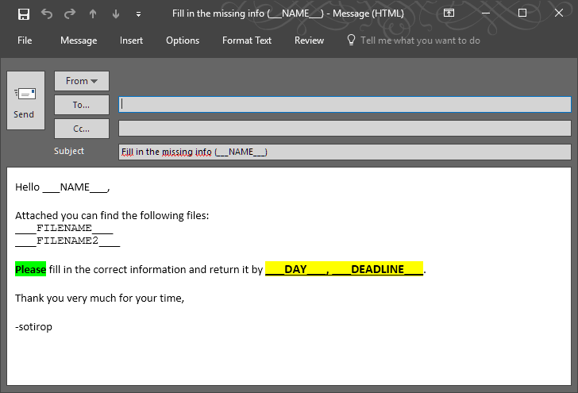
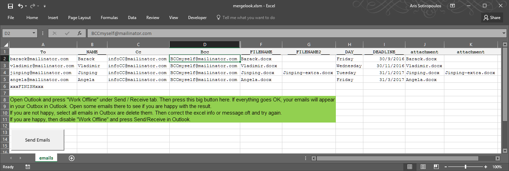
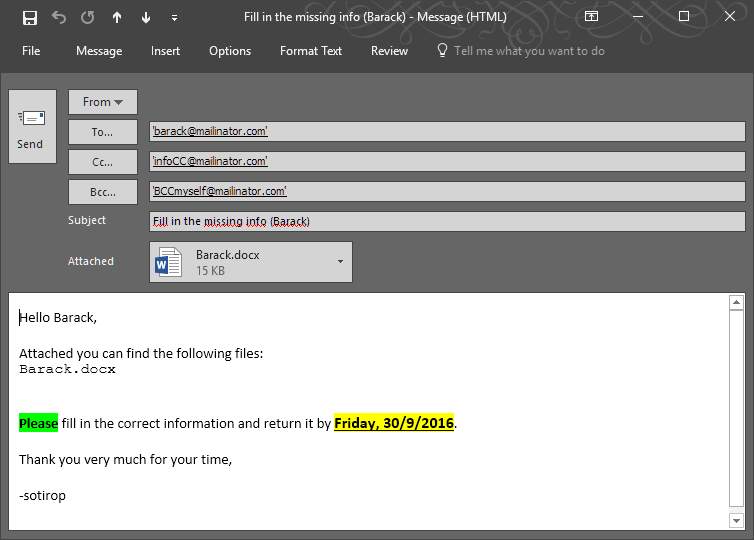

# mergelook

Using **mergelook** you can send multiple emails with attachments, using the same email template. It's like using the mail merge feature of MS Word, but each email can contain one or more attachments. This works only on MS Windows.

## More info

There are times when you want to send a personalized email --based on a common template-- to multiple recipients. MS Word, in combination with Excel and Outlook, offers this functionality which is called Mail Merge. However, the functionality is limited to sending emails without attachments.

With **mergelook** you can send personalized emails with attachments to multiple recipients, using only MS Excel and Outlook. Enjoy!

## Instructions

In order to use **mergelook**, you need to have MS Excel and MS Outlook installed. From this repository, you only need the following files:

+ `mergelook.xlsm`
+ `message.oft`

`message.oft` is the template of the email to be sent to multiple recipients.
Special words in the template will be replaced with information in the `mergelook.xlsm` file. `mergelook.xlsm` is an excel file containing VBA code, which handles the word replacement.

When you open `mergelook.xlsm`, you should press "Enable Content" so that the VBA script can be executed.

### `message.oft`
This is how `message.oft` looks like:

For each email, the ``___NAME___`` will be replaced with corresponding values in `mergelook.xlsm`: ``Barack``, ``Vladimir``, etc. Similarly, the ``___FILENAME___`` will be replaced with corresponding values in `mergelook.xlsm`: ``Barack.docx``, ``Vladimir.docx``, etc.

### `mergelook.xlsm`
This is how `mergelook.xlsm` looks like:

In columns with header ``To``, you should put the recipients' email addresses. Multiple recipients per email (row) are supported. The same goes for the columns with ``Cc`` and ``Bcc`` headers.

### Sample email
This is how a sample email looks like:

## Attention
The code should not be used for production use. Before using it, put Outlook in Offline Mode using the following instructions:

1. Open Outook
2. Go to "Send / Receive" tab
3. Enable "Work Offline" mode. This button should be pressed

When the information in `mergelook.xlsm` is complete, press the "Send Emails" button in `mergelook.xlsm` and watch the Outbox folder in Outlook filling in with messages. Open some messages to test if everything went OK. If you are happy, press the "Send All" in Outlook so all messages can leave for their destination.
